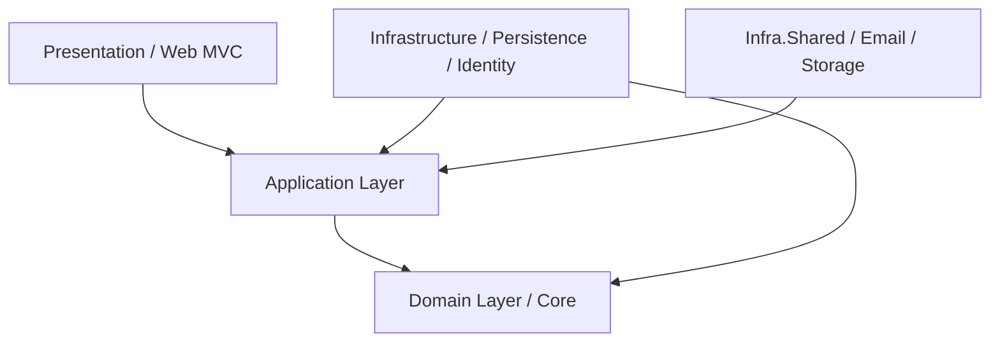
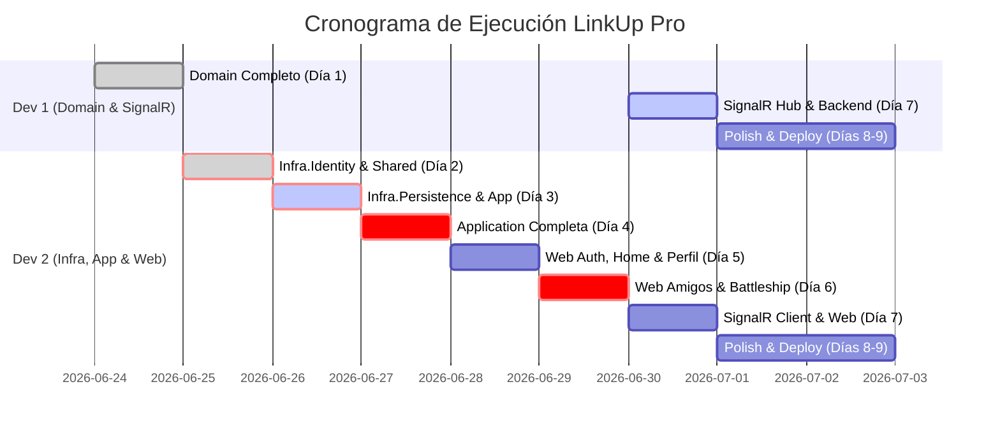

# 🏆 Master Plan y Guía de Evaluación Definitiva: LinkUp Pro

> [!IMPORTANT]
> **Objetivo del Documento:** Este documento integra el **Documento Funcional**, la **Rúbrica de Evaluación (1,510 puntos / 151 criterios)** y el **Cronograma de Trabajo Diario (Días 1 al 9)** del equipo (**Dev 1** y **Dev 2**). Es la guía maestra para garantizar el **100% de la calificación**.

---

## 📊 Resumen Ejecutivo de Evaluación

| Módulo / Categoría | Puntos Totales | Criterios | Responsable Principal | Estado |
| :--- | :---: | :---: | :---: | :---: |
| **Funcionalidades Generales** | 50 | 5 | Dev 1 & Dev 2 | 🟢 En Proceso |
| **Login, Registro y Recuperación** | 150 | 15 | Dev 2 | 🟢 En Proceso |
| **Publicaciones (Home)** | 170 | 17 | Dev 2 | ⏳ Pendiente |
| **Notificaciones de Interacción** | 60 | 6 | Dev 2 | ⏳ Pendiente |
| **Amigos** | 100 | 10 | Dev 2 | ⏳ Pendiente |
| **Solicitudes de Amistad** | 140 | 14 | Dev 2 | ⏳ Pendiente |
| **Battleship (Juego Naval)** | 180 | 18 | Dev 2 (Web) / Dev 1 (SignalR) | ⏳ Pendiente |
| **Mi Perfil** | 90 | 9 | Dev 2 | ⏳ Pendiente |
| **Seguridad Funcional** | 220 | 22 | Dev 2 & Dev 1 | 🟢 En Proceso |
| **Reglas Técnicas y Arquitectura** | 350 | 35 | Dev 1 & Dev 2 | 🟢 En Proceso |
| **TOTAL** | **1,510** | **151** | — | **Meta: 100%** |

---

## 🏗️ 1. Estándares Técnicos y Arquitectura (.NET 9)

> [!WARNING]
> La rúbrica penaliza severamente la mala implementación arquitectónica. Si no se respetan las dependencias de capas o se mezcla lógica de negocio en los controladores, se evaluará como **incorrectamente aplicado**.

### Reglas de Oro Arquitectónicas
1. **Stack Core:** ASP.NET Core MVC utilizando **.NET 9**.
2. **Arquitectura Onion (Cebolla):**
   * `Domain`: Entidades audítables, ValueObjects (`Email`, `PhoneNumber`), Enums, Excepciones y Reglas de Negocio (`IBusinessRule`). **Completado por Dev 1 el Día 1. Dev 2 no debe modificarlo.**
   * `Application`: Interfaces de repositorios y servicios, DTOs, ViewModels, validaciones (FluentValidation) y perfiles de AutoMapper.
   * `Infrastructure`: Persistencia con EF Core Code First, migraciones, implementación de repositorios e Identity.
   * `Shared`: Servicios transversales (Envío de correos SMTP/MailKit y Almacenamiento local de imágenes).
   * `Web`: Controladores, Vistas Razor, Scripts (JS/SignalR) y Filtros.
3. **Patrón Repositorio y Servicios:**
   * **Controladores 100% Livianos:** Tienen prohibido contener lógica de negocio compleja o acceder directamente a `DbContext`. Deben llamar a la capa de servicios y retornar vistas con ViewModels.
   * **Separación estricta de Modelos:**
     * `Entidades` $\leftrightarrow$ `DTOs` (Capa de Servicios / Negocio).
     * `DTOs` $\leftrightarrow$ `ViewModels` (Capa de Presentación / Controladores).
     * **Prohibido** pasar entidades de EF Core directamente a las Vistas Razor.
4. **Mapeo y Validaciones:**
   * Uso obligatorio de **AutoMapper** para todas las transformaciones.
   * Validaciones de entrada implementadas con **FluentValidation** y validadas en el servidor.
5. **Asincronía y Fechas:**
   * Operaciones I/O (`async/await`) en base de datos, correos y archivos.
   * Almacenamiento de fechas en **UTC** y conversión a hora local al mostrarlas.

---

## 🛡️ 2. Blindaje y Seguridad Funcional (Puntos Críticos)

> [!CAUTION]
> Ocultar botones o enlaces en las vistas **no sustituye** la autorización en el servidor. Todas las operaciones deben validarse estrictamente en el backend antes de ejecutarse.

* **Autenticación e Identity:** ASP.NET Core Identity obligatorio para contraseñas (hashing), tokens de un solo uso y gestión de sesiones.
* **Control de Rutas (`[Authorize]` vs `[AllowAnonymous]`):**
  * Todas las pantallas internas (*Home, Amigos, Solicitudes, Notificaciones, Battleship, Mi Perfil*) deben protegerse con `[Authorize]`.
  * Acciones públicas (*Login, Registro, Activación, Restablecer Clave*) llevan `[AllowAnonymous]` explícito en la acción, no a nivel de controlador general si tiene rutas mixtas.
* **Protección CSRF y Mass Assignment:**
  * Toda petición que modifique datos (`POST`, `PUT`, `DELETE`) requiere `[ValidateAntiForgeryToken]`. **Prohibido modificar información mediante peticiones `GET`**.
  * Los ViewModels solo expondrán los campos estrictamente editables. Si un atacante inyecta campos como `PropietarioId`, `EstadoCuenta`, `TurnoActual` o `GanadorId`, el backend debe ignorarlos.
* **IDOR (Insecure Direct Object References):** Conocer la URL o el ID de una publicación, perfil, partida o solicitud no concede acceso. El servidor siempre verificará la relación de propiedad, privacidad ("Solo amigos") y estado activo de las cuentas.
* **Prevención XSS:** Todo texto ingresado por el usuario (publicaciones, comentarios) se procesa como texto plano codificado. Prohibida la ejecución de etiquetas HTML, JS o iframes arbitrarios.
* **Seguridad en Archivos:**
  * Extensiones permitidas: `.jpg`, `.jpeg`, `.png`, `.webp`.
  * Tamaño máximo: **5 MB**.
  * El nombre físico del archivo se genera internamente mediante `Guid.NewGuid()`. **Jamás** se debe conservar el nombre original del cliente.
* **Manejo Seguro de Errores:**
  * Ante cualquier fallo interno, mostrar: *"Ocurrió un error al procesar la solicitud. Inténtelo nuevamente."*
  * **Prohibido** mostrar stack traces, excepciones SQL, rutas del servidor o cadenas de conexión en el navegador.

---

## 📋 3. Desglose de Requerimientos por Módulo

### 🔑 A. Login, Registro y Recuperación (150 pts)
* **Login:** Validación de credenciales con mensaje genérico: *"El nombre de usuario o la contraseña son incorrectos."* Control para mostrar/ocultar contraseña.
* **Sesiones Persistentes:** Opción *Mantener sesión iniciada* (cookie máxima de 7 días). Si no se marca, cierra al cerrar navegador o tras **30 minutos de inactividad**.
* **Bloqueos:** Bloqueo si la cuenta está inactiva. Bloqueo temporal por **15 minutos** tras **5 intentos fallidos consecutivos**.
* **Registro:** Campos obligatorios. Teléfono con formato RD (*ej. 809-555-1234*). Usuario y Correo únicos (ignora mayúsculas/minúsculas).
* **Fortaleza de Contraseña:** Indicador visual dinámico (Débil $\le 2$, Media $3-4$, Fuerte $5$ criterios: 8+ chars, mayúscula, minúscula, número, carácter especial). Solo se registra si es **Fuerte**.
* **Activación y Recuperación:** Correo con token de activación (vigencia 24h, un solo uso). Reenvío de correo con espera mínima de **5 minutos**. Restablecimiento (token 1h) con mensaje genérico para no revelar si la cuenta existe. Al restablecer, invalida sesiones anteriores.

### 🏠 B. Publicaciones / Home (170 pts)
* **Estructura:** Texto + Imagen **O** Texto + Video de YouTube. *Prohibido solo texto, solo imagen o solo video.* Renderizado incrustado del reproductor de YouTube extrayendo su ID.
* **Privacidad:** *Solo amigos* (defecto) o *Solo yo*. Cambiar a *Solo yo* o romper amistad oculta el post del feed del amigo.
* **Interacciones:** Checkbox *Permitir comentarios* (activo por defecto). Si se desactiva, oculta el input pero **conserva los comentarios existentes**.
* **Hilos Anidados:** Opción *Responder* en comentarios con indentación visual.
* **Edición y Eliminación:** Solo el autor edita/elimina su post (eliminación lógica). Autores editan/eliminan sus comentarios. Si se borra un comentario padre con respuestas, se sustituye por: *"Este comentario fue eliminado"*.
* **Reacciones:** *Me gusta* o *No me gusta* (única por usuario; toggle o cambio de tipo).

### 👥 C. Amigos y Solicitudes (240 pts)
* **Amigos:** Indicadores de *Total de amigos* y *Publicaciones disponibles*. Listado alfabético con botón *Eliminar amigo* (requiere confirmación). Buscador por nombre/apellido/usuario. Cálculo de *Amigos en común* (clic abre listado con foto y nombre).
* **Solicitudes:** Contador en menú principal **exclusivo para solicitudes recibidas pendientes**. Pestañas de *Recibidas pendientes* y *Enviadas*.
* **Nueva Solicitud:** Muestra usuarios activos sin amistad ni solicitud pendiente. Radio button para seleccionar de a uno.
* **Consistencia Atómica:** Aceptar una solicitud reactiva una amistad eliminada o crea una nueva en una sola transacción, evitando duplicaciones por concurrencia. Opción *Eliminar del historial* lógica.

### 🔔 D. Notificaciones (60 pts)
* **Generación:** Al comentar, responder, reaccionar o cambiar reacción en contenidos ajenos. *No genera notificación por acciones propias.*
* **Comportamiento:** No requiere SignalR obligatorio para el contador (se actualiza al navegar/recargar). Listado cronológico, indicador Leída/No leída y botón *Marcar todas como leídas*.
* **Integridad:** Redirige al post respetando permisos. Si se borró o no hay amistad: *"El contenido relacionado con esta notificación ya no se encuentra disponible para usted."*

### 🚢 E. Battleship - Juego Naval (180 pts)
* **Pantalla Principal:** Partidas activas (oponente, fecha, horas transcurridas, botones Entrar y Rendirse con confirmación donde gana el otro) e Historial. Botón *Iniciar nueva partida* (selección de amigo activo sin partida activa en curso).
* **Posicionamiento (Fase 1):** Tablero 12x12. 5 barcos obligatorios (tamaños 2, 3, 3, 4, 5). Selección de celda + dirección (*arriba, abajo, derecha, izquierda*). Validación en servidor: impedir que se salga del tablero o se superponga. Celdas ocupadas bloqueadas visualmente. Pantalla de espera si el rival no ha colocado barcos.
* **Batalla (Fase 2):** Alternancia estricta de turnos (empieza el creador). Acierto en **Rojo**, fallo en **Verde**. Bloqueo de ataques fuera de turno o en celdas ya atacadas. Hundimiento al acertar todas las posiciones de un barco. Victoria al hundir los 5 barcos (17 posiciones). Botón manual *Refrescar pantalla*.
* **Abandono (48 Horas):** Si un jugador pasa 48 horas sin atacar, al entrar o refrescar se declara ganador por abandono al oponente.
* **Historial:** Resumen superior (jugadas, ganadas, perdidas). En ganador muestra **"Yo"** o nombre del rival. Botones para *Ver resultado* (tableros finales de ataque de ambos y de posicionamiento propio en modo solo lectura).

### 👤 F. Mi Perfil (90 pts)
* Edición de Nombre, Apellido y Teléfono. Campos Usuario y Correo son **solo lectura** (blindados en backend).
* Subida opcional de foto de perfil (reemplaza la anterior y borra el archivo anterior).
* Cambio opcional de contraseña llenando *Clave actual, Nueva y Confirmar*. Invalida sesiones previas al cambiar exitosamente.

---

# 📅 4. Cronograma Maestro y Roadmap de Ejecución (Días 1 al 9)

## ✅ Día 1 — Martes 24 Jun (COMPLETADO - Dev 1)
* **Capa:** `Domain`
* **Entregables:** `BaseEntity`, `AuditableEntity`, `PhoneNumber`, `Email`, 15 Entidades, 12 Enums, 5 Excepciones, 36 Reglas de negocio (`IBusinessRule`), 14 Interfaces de repositorios.
* **Nota para Dev 2:** Pull realizado. Prohibido tocar el Domain.

---

## 🛠️ Día 2 — Miércoles 25 Jun (EN CURSO - Dev 2)
* **Capas:** `Infra.Identity` + `Infra.Shared`
* **Checklist Mañana (`Infra.Identity`):**
  - [ ] Configurar `AppUser.cs` (`IdentityUser<Guid>`) y `AppRole.cs`.
  - [ ] Blindar `IdentityServiceExtensions.cs`:
    - `Lockout.DefaultLockoutTimeSpan = TimeSpan.FromMinutes(15)`
    - `Lockout.MaxFailedAccessAttempts = 5`
    - Opciones de contraseña (8+ chars, mayúscula, minúscula, número, especial).
    - Vigencia de tokens (24h activación, 1h restablecimiento).
  - [ ] `IdentitySeeder.cs` para datos iniciales.
* **Checklist Tarde (`Infra.Shared`):**
  - [ ] `EmailService.cs` (MailKit/SMTP) + Plantillas HTML (Activación y Reset).
  - [ ] `LocalImageStorageService.cs`: Guardado con `Guid.NewGuid()`, borrado de imagen anterior.
  - [ ] `FileValidationHelper.cs`: Validar extensiones (`.jpg`, `.jpeg`, `.png`, `.webp`) y peso máx **5 MB**.
  - [ ] `YouTubeHelper.cs` (extracción de ID de video), `DateTimeHelper`, `StringHelper`.
  - [ ] Configuración en `appsettings.json` y `SharedServiceExtensions.cs`.
* **Entregable del Día:** Compilación limpia de Identity y Shared. Envío exitoso de correo de prueba y guardado/borrado de imágenes.

---

## 🏗️ Día 3 — Jueves 26 Jun (Dev 2)
* **Capas:** `Infra.Persistence` + `Application` (Auth, User, Post)
* **Checklist Mañana (`Infra.Persistence`):**
  - [ ] `ApplicationDbContext.cs` (`IdentityDbContext<AppUser, AppRole, Guid>`).
  - [ ] 15 archivos en `Configurations/` (`IEntityTypeConfiguration<T>`).
  - [ ] `GenericRepository<T>` + 14 repositorios específicos.
  - [ ] Ejecutar migración inicial: `dotnet ef migrations add InitialCreate`.
* **Checklist Tarde (`Application`):**
  - [ ] `LoginService`, `RegisterService` (validación única *case-insensitive*), `AccountActivationService`, `PasswordResetService`, `SessionService`.
  - [ ] `UserService`: Perfil, edición, cambio de foto con rollback, cambio de clave (si campos vacíos, conserva actual).
  - [ ] `PostService`, `PostQueryService`, `PostPrivacyService`.
  - [ ] ViewModels, DTOs y FluentValidation (5 validadores Auth, validadores Post).
  - [ ] AutoMapper Profiles (`Auth`, `User`, `Post`).

---

## ⚙️ Día 4 — Viernes 27 Jun (Dev 2)
* **Capa:** `Application` al 100% (Comment, Reaction, Notification, Friendship, Battleship)
* **Checklist Mañana:**
  - [ ] `CommentService`, `CommentReplyService` + DTOs/ViewModels/Validators.
  - [ ] `ReactionService` + DTOs/ViewModels/Validators.
  - [ ] `NotificationService`, `NotificationDispatchService` (integrar en Comment y Reaction; no notificar auto-acciones).
  - [ ] `FriendshipService`, `MutualFriendService`, `FriendRequestService` (transacción atómica al aceptar para evitar duplicados), `FriendRequestQueryService`.
* **Checklist Tarde:**
  - [ ] `BattleshipGameService`, `BattleshipSetupService`, `BattleshipAttackService`, `BattleshipHistoryService`.
  - [ ] DTOs, ViewModels y 2 Validadores de Battleship.
  - [ ] AutoMapper profiles restantes (`Comment`, `Reaction`, `Friendship`, `FriendRequest`, `Notification`, `Battleship`).
  - [ ] Registrar FluentValidation en `ApplicationServiceExtensions.cs` (`AddValidatorsFromAssembly`).
* **Entregable del Día:** `Application` 100% completa, probada y validada.

---

## 🖥️ Día 5 — Sábado 28 Jun (Dev 2)
* **Capa:** `Web` MVC (Setup, Auth, Home, Notificaciones, Perfil)
* **Checklist Mañana:**
  - [ ] `Program.cs` completo: inyección de dependencias, cookies seguras (`HttpOnly`, `Secure`, `SameSite`).
  - [ ] Filtros globales: `ActiveAccountFilter` (bloquea usuarios inactivos) y `HandleDomainExceptionFilter`.
  - [ ] Layouts: `_Layout.cshtml`, `_Menu.cshtml` (contadores), `_Alerts.cshtml`, `Error.cshtml`.
  - [ ] Controladores y Vistas de Auth (`Login`, `Register`, `ForgotPassword`, `ResetPassword`, `ResendActivation`).
  - [ ] Script `passwordStrength.js` (evaluación en tiempo real Débil/Media/Fuerte).
  - [ ] Controladores y Vistas de Perfil (`ProfileEditController`, `ProfileViewController`, `Edit.cshtml`).
  - [ ] Controladores y Vistas de Notificaciones (`NotificationListController`, `NotificationMarkReadController`, `Index.cshtml`).
* **Checklist Tarde:**
  - [ ] Partials: `_PostCard.cshtml` (con reproductor YouTube incrustado), `_CommentSection.cshtml`, `_ReactionBar.cshtml`.
  - [ ] Controladores y Vistas de Publicaciones (`PostController`, `Create`, `Edit`, `Delete`, filtros en `Index`).
  - [ ] Controladores y Vistas de Comentarios (`CommentController`, `ReplyController`).
  - [ ] `ReactionController` + `post.js` (toggle dinámico imagen/video en modal de creación) + `site.js`.

---

## 🤝 Día 6 — Domingo 29 Jun (Dev 2) -> *¡Punto Crítico!*
* **Capa:** `Web` MVC (Amigos, Solicitudes, Battleship Base sin SignalR)
* **Checklist Mañana:**
  - [ ] Controladores de Amigos: `FriendListController`, `FriendProfileController`, `FriendDeleteController` + Vistas.
  - [ ] Controladores de Solicitudes (6): `List`, `Send`, `Accept`, `Reject`, `Cancel`, `Hide` + Vistas.
  - [ ] Asegurar que el contador en `_Menu.cshtml` cuente solo **solicitudes recibidas pendientes**.
  - [ ] Listado y modal de *Amigos en común*.
* **Checklist Tarde:**
  - [ ] Controladores de Battleship (Recarga manual): `GameList`, `Create`, `Surrender`, `Setup`, `ShipSelect`, `ShipPlace`, `Attack`, `MyBoard` (botón "Refrescar"), `History`, `Result`.
  - [ ] Vistas de Battleship (`Game`, `Setup`, `Attack`, `History`).
  - [ ] Script `battleship-board.js`: Tablero 12x12, renderizado de celdas (`hit`, `miss`, `ship`, `occupied`), validación para evitar salida de tablero o superposición de barcos.
* **🚨 ENTREGABLE NOCTURNO:** Hacer **PUSH** al repositorio antes de medianoche. Dev 1 arranca el lunes conectando SignalR sobre esta base.

---

## ⚡ Día 7 — Lunes 30 Jun (Ambos Full - SignalR e Integración)
* **Checklist Dev 1 (Backend & Hub):**
  - [ ] Crear `BattleshipHub.cs`: `JoinGame(gameId)`, grupos, emisión de eventos (`TurnChanged`, `AttackResult`, `GameFinished`, `OpponentReady`, `GameAbandoned`).
  - [ ] Abstracción `IBattleshipHubService` y `BattleshipHubService`.
  - [ ] Inyectar e integrar notificación SignalR en `BattleshipAttackService` y `BattleshipSetupService`.
  - [ ] Generar migración final: `dotnet ef migrations add FinalSchema`.
* **Checklist Dev 2 (Frontend & Seguridad):**
  - [ ] Script `battleship-signalr.js`: conexión al Hub, escucha de eventos y actualización de celdas DOM sin recargar.
  - [ ] Actualizar `AttackBoard.cshtml` para incluir SignalR client.
  - [ ] Actualizar `WaitingOpponent.cshtml`: escuchar `OpponentReady` $\rightarrow$ redirección automática a batalla.
  - [ ] Auditoría de Seguridad Web: verificar `[ValidateAntiForgeryToken]` en todos los POST, `[Authorize]` en controladores internos y `[AllowAnonymous]` en Auth.

---

## 🎯 Días 8 y 9 — Martes 1 Jul y Miércoles 2 Jul (Ambos - Polish, QA y Deploy)
* **Checklist Martes 1 Jul (Polish & Seguridad):**
  - [ ] Auditoría de Cookies en `Program.cs` (`HttpOnly`, `Secure`, `SameSite`).
  - [ ] Pruebas IDOR: Intentar entrar por URL directa a posts privados, perfiles o partidas ajenas. Verificar expulsión.
  - [ ] Polish UI: Integrar `_Alerts` en todas las pantallas y verificar mensajes de estado vacío (*"Todavía no ha realizado ninguna publicación"*, etc.).
  - [ ] Prueba de regresión completa de flujos de usuario.
* **Checklist Miércoles 2 Jul (QA Final & Entrega):**
  - [ ] Simular regla de **Abandono de 48 horas** en Battleship alterando fechas en BD.
  - [ ] Probar SignalR en múltiples navegadores simultáneos.
  - [ ] Verificar ocultamiento de stack traces ante errores forzados.
  - [ ] Compilación de producción: `dotnet publish`.
  - [ ] Despliegue en servidor y **Entrega Final 🎯**.

---
*Documento generado para LinkUp Pro — Garantía de Cumplimiento 100% (1,510 Puntos).*
